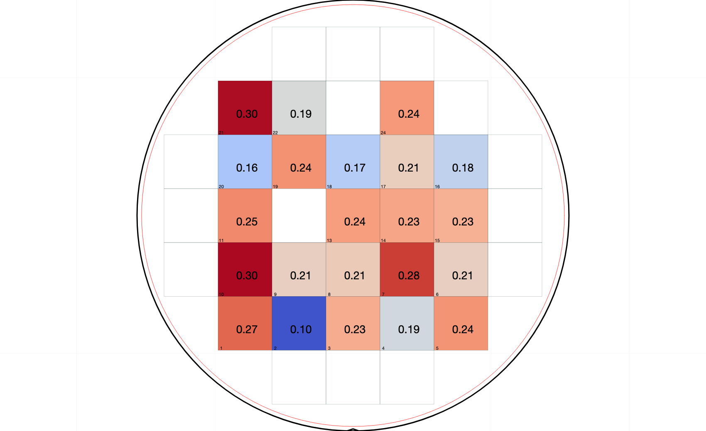

# Wafer Data Visualization

This project contains scripts to visualize wafer data from an Excel file. It generates wafer maps with color-coded cells based on the median values of specific physical properties (e.g., Vt, SS, DIBL) and adds a corresponding color bar to the image. This repository is specific for loading the output file from another repository, DataExtracter. [https://github.com/Kampfer0083/DataExtracter]

## Table of Contents

- [Installation](#installation)
- [Usage](#usage)
- [Functions](#functions)
  - [add_colorbar_to_image](#add_colorbar_to_image)
  - [initialize_wafer_map](#initialize_wafer_map)
  - [value_to_color](#value_to_color)
- [Contributing](#contributing)
- [License](#license)
- [Contact Information](#contact-information)

## Installation

1. Clone the repository:
    ```sh
    git clone https://github.com/Kampfer0083/MappingTheWafer.git
    ```
2. Navigate to the project directory:
    ```sh
    cd MappingTheWafer
    ```
3. Install the required dependencies:
    ```sh
    pip install pandas matplotlib pillow wafermap
    ```

## Usage

1. Run the script:
    ```sh
    python MappingTheWafer.py
    ```
2. Provide the required inputs when prompted:
    - Path to your .xlsx file
    - Physical property of the input data set (Vt, SS, or DIBL)

3. The script processes the data for the specified physical property and generates wafer map visualizations with color bars. The output images are saved in the same directory.

## Functions

### add_colorbar_to_image

This function adds a color bar to an image.

- **Parameters:**
  - `image_path`: Path to the original image.
  - `vmin`: Minimum value for the color bar.
  - `vmax`: Maximum value for the color bar.
  - `cmap`: Colormap to use (default is 'coolwarm').
  - `bar_width`: Width of the color bar (default is 0.05).
  - `label`: Label for the color bar.

- **Returns:**
  - `combined_image_path`: Path to the new image with the color bar.

### initialize_wafer_map

This function initializes a `WaferMap` object with predefined parameters.

- **Returns:**
  - `wafer_map`: Initialized `WaferMap` object.

### value_to_color

This function maps a value to a color using a colormap.

- **Parameters:**
  - `value`: The value to map.
  - `global_min`: The minimum value in the data set.
  - `global_max`: The maximum value in the data set.

- **Returns:**
  - `color`: Hex color code representing the value.

- **An Example of the output:**
  - 


## Contributing

Contributions are what make the open-source community such an amazing place to learn, inspire, and create. Any contributions you make are **greatly appreciated**.

1. Fork the Project
2. Create your Feature Branch (`git checkout -b feature/AmazingFeature`)
3. Commit your Changes (`git commit -m 'Add some AmazingFeature'`)
4. Push to the Branch (`git push origin feature/AmazingFeature`)
5. Open a Pull Request

## License

Distributed under the MIT License. See `LICENSE` for more information.

## Contact Information

Your Name - [kampfer.lu@gmail.com](mailto:your-email@example.com)

Project Link: [https://github.com/your-username/your-repo-name](https://github.com/Kampfer0083/MappingTheWafer)](https://github.com/your-username/your-repo-name)
